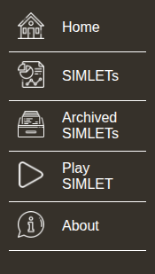
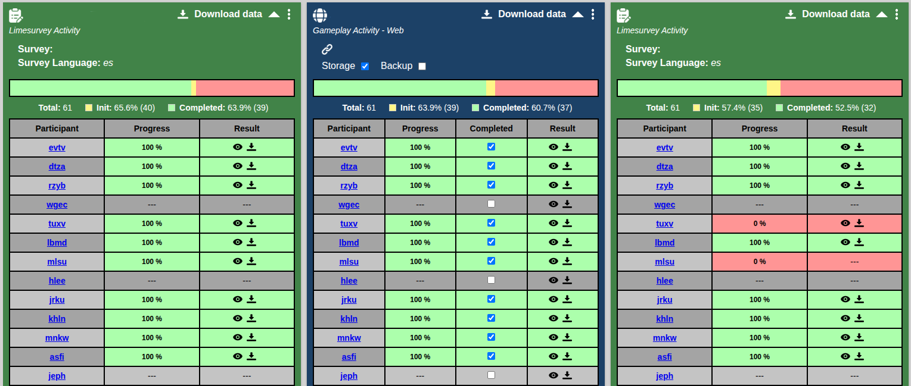

# <%= t("title", { ns : "about" }) %>
<%= t("description", { ns : "about" }) %>
<br><br>
<%= t("text", { ns : "about" }) %>

<hr>

## <%= t("index.title", { ns : "about" }) %>
<%_ if (!user) { _%>
- [<%= t("header.logout.title", { ns : "about" }) %>](#header-visitor-section)
<%_ } else { _%>
- [<%= t("header.login.title", { ns : "about" }) %>](#header-user-section)
- [<%= t("menu.title", { ns : "about" }) %>](#left-menu-section)
<%_ } _%>
- [<%= t("simva.title", { ns : "about" }) %>](#simva-section)
- [<%= t("simlet.title", { ns : "about" }) %>](#simlet-section)
- [<%= t("session.title", { ns : "about" }) %>](#session-section)
- [<%= t("activity.title", { ns : "about" }) %>](#activity-section)
- [<%= t("users.title", { ns : "about" }) %>](#users-section)
- [<%= t("integration.title", { ns : "about" }) %>](#integration-section)
- [<%= t("sessionManagement.title", { ns : "about" }) %>](#session-management-section)
- [<%= t("xapi.dashboard.title", { ns : "about" }) %>](#xapi-section)

<hr>

<% if (!user) { %>

## <%= t("header.logout.title", { ns : "about" }) %> {#header-visitor-section}
<%= t("header.logout.description", { ns : "about" }) %>


#### <%= t("header.logout.language.title", { ns : "about" }) %>
<%= t("header.logout.language.description", { ns : "about" }) %>

####  <%= t("header.logout.about.title", { ns : "about" }) %>
<%= t("header.logout.about.description", { ns : "about" }) %>

####  <%= t("header.logout.research.title", { ns : "about" }) %>
<%= t("header.logout.research.description", { ns : "about" }) %>

####  <%= t("header.logout.login.title", { ns : "about" }) %>
<%= t("header.logout.login.description", { ns : "about" }) %>

<% } else { %>

## <%= t("header.login.title", { ns : "about" }) %> {#header-visitor-section}
<%= t("header.login.description", { ns : "about" }) %>


<%= t("header.login.note", { ns : "about" }) %>


<br>

#### <%= t("header.logout.language.title", { ns : "about" }) %>
<%= t("header.logout.language.description", { ns : "about" }) %>

####  <%= t("header.login.account.title", { ns : "about" }) %>
<%= t("header.login.account.description", { ns : "about" }) %>

####  <%= t("header.logout.research.title", { ns : "about" }) %>
<%= t("header.logout.research.description", { ns : "about" }) %>

####  <%= t("header.login.logout.title", { ns : "about" }) %>
<%= t("header.login.logout.description", { ns : "about" }) %>

<hr>

## <%= t("menu.title", { ns : "about" }) %> {#left-menu-section}
<%= t("menu.description", { ns : "about" }) %>



<%= t("menu.note", { ns : "about" }) %>
<br>
<br>

####  <%= t("menu.home.title", { ns : "about" }) %>
<%= t("menu.home.description", { ns : "about" }) %>

####  <%= t("menu.simlets.title", { ns : "about" }) %>
<%= t("menu.simlets.description", { ns : "about" }) %>

####  <%= t("menu.archived.title", { ns : "about" }) %>
<%= t("menu.archived.description", { ns : "about" }) %>

####  <%= t("menu.play.title", { ns : "about" }) %>
<%= t("menu.play.description", { ns : "about" }) %>

####  <%= t("menu.about.title", { ns : "about" }) %>
<%= t("menu.about.description", { ns : "about" }) %>

<% } %>

<hr>

## <%= t("simva.title", { ns : "about" }) %> {#simva-section}
<%= t("simva.description", { ns : "about" }) %>

#### <%= t("simva.frontend.title", { ns : "about" }) %>
<%= t("simva.frontend.description", { ns : "about" }) %>

#### <%= t("simva.roles.title", { ns : "about" }) %>
<%= t("simva.roles.description", { ns : "about" }) %>

<hr>

## <%= t("simlet.title", { ns : "about" }) %> {#simlet-section}
<%= t("simlet.description", { ns : "about" }) %>

#### <%= t("archived_simlet.title", { ns : "about" }) %>
<%= t("archived_simlet.description", { ns : "about" }) %>

<hr>

## <%= t("session.title", { ns : "about" }) %> {#session-section}
<%= t("session.description", { ns : "about" }) %>

<hr>

## <%= t("activity.title", { ns : "about" }) %> {#activity-section}
<%= t("activity.description", { ns : "about" }) %>

<!-- #### <%= t("limesurvey.title", { ns : "about" }) %>
<%= t("limesurvey.description", { ns : "about" }) %>

#### <%= t("gameplay.title", { ns : "about" }) %>
<%= t("gameplay.description", { ns : "about" }) %>

#### <%= t("manual.title", { ns : "about" }) %>
<%= t("manual.description", { ns : "about" }) %> -->

<hr>

## <%= t("group.title", { ns : "about" }) %> {#group-section}
<%= t("group.description", { ns : "about" }) %>

<hr>

## <%= t("users.title", { ns : "about" }) %> {#users-section}
<%= t("users.description", { ns : "about" }) %>

#### <%= t("supervisor.title", { ns : "about" }) %>
<%= t("supervisor.description", { ns : "about" }) %>

#### <%= t("coordinator.title", { ns : "about" }) %>
<%= t("coordinator.description", { ns : "about" }) %>

#### <%= t("participant.title", { ns : "about" }) %>
<%= t("participant.description", { ns : "about" }) %>

<hr>

## <%= t("integration.title", { ns : "about" }) %> {#integration-section}
<br>

#### <%= t("gameclient.title", { ns : "about" }) %>
<%= t("gameclient.description", { ns : "about" }) %>

<!-- #### <%= t("integratedgame.title", { ns : "about" }) %>
<%= t("integratedgame.description", { ns : "about" }) %> -->

<hr>

## <%= t("sessionManagement.title", { ns : "about" }) %> {#session-management-section}
<br>

#### <%= t("manualcompletion.title", { ns : "about" }) %>
<%= t("manualcompletion.description", { ns : "about" }) %>

#### <%= t("dashboard.title", { ns : "about" }) %>
<%= t("dashboard.description", { ns : "about" }) %>

<hr>

## <%= t("xapi.dashboard.title", { ns : "about" }) %> {#xapi-section}
<%= t("xapi.dashboard.intro", { ns : "about" }) %>


<br>

#### <%= t("xapi.dashboard.backend.title", { ns : "about" }) %>
<%= t("xapi.dashboard.backend.desc", { ns : "about" }) %>
```
{
	"actor": {
		"account": {
			"homePage" : "...",
			"name" : "fybu"
		}
	},
	"verb": {
		"id": "http://adlnet.gov/exapi/verbs/initialized"
	},
	"object" : {
		"definition" : {
			"type" : "https://w3id.org/xapi/seriousgames/activity-types/level"
		},
		"id" : "..."
	},
	"result" : ...,
	"context": {
		"contextActivities": {
			"category": [{"id": "https://w3id.org/xapi/serious-game"}],
		},
		"registration": "18c01bd5-a384-42ad-a96a-9572d4674b87"
	},
	"id": "ad48cb27-0536-4b22-a0fb-6c4f80c57d5a",
	"timestamp" : "2024-06-09T19:32:57.369Z",
	"stored" : "2024-06-09T19:41:23.456Z"
}
```
<br>
<br>

#### <%= t("xapi.dashboard.activitytypes.title", { ns : "about" }) %>
<br>

| <%= t("xapi.dashboard.activitytypes.col1", { ns : "about" }) %>       	| <%= t("xapi.dashboard.activitytypes.col2", { ns : "about" }) %> 	|
|----------|----------|
| <%= t("xapi.dashboard.activitytypes.game", { ns : "about" }) %>       	| https://w3id.org/xapi/seriousgames/activity-types/serious-game  	|
| <%= t("xapi.dashboard.activitytypes.limesurvey", { ns : "about" }) %> 	| http://adlnet.gov/expapi/activities/assessment                  	|
| <%= t("xapi.dashboard.activitytypes.manual", { ns : "about" }) %>     	| http://adlnet.gov/expapi/activities/???                         	|

<br>
<br>

#### <%= t("xapi.dashboard.visibledata.title", { ns : "about" }) %>
<%= t("xapi.dashboard.visibledata.desc", { ns : "about" }) %>

**<%= t("xapi.dashboard.initialized.title", { ns : "about" }) %>**
\
<%= t("xapi.dashboard.initialized.desc", { ns : "about" }) %>

```
{
	"actor": {
		"account": {
			"homePage" : "...",
			"name" : "fybu"
		}
	},
	"verb": {
		"id": "http://adlnet.gov/exapi/verbs/initialized"
	},
	"object" : {
		"definition" : {
			"type" : "https://w3id.org/xapi/seriousgames/activity-types/serious-game"
		},
		"id" : "..."
	},
	"context":  {
		"contextActivities": {
			"category": [{"id": "https://w3id.org/xapi/serious-game"}],
		},
		"registration": "18c01bd5-a384-42ad-a96a-9572d4674b87"
	},
	"id": "b9785111-8b19-4193-80a0-48c044846f01",
	"timestamp" : "2024-06-09T19:05:12.245Z",
	"stored" : "2024-06-09T19:06:23.192Z"
}
```
<br>

**<%= t("xapi.dashboard.progress.title", { ns : "about" }) %>**
\
<%= t("xapi.dashboard.progress.desc", { ns : "about" }) %>

| <%= t("xapi.dashboard.progress.col1", { ns : "about" }) %>       	        | <%= t("xapi.dashboard.progress.col2", { ns : "about" }) %> 	|
|----------|----------|
| <%= t("xapi.dashboard.activitytypes.game", { ns : "about" }) %>       	| result.extensions['https://w3id.org/xapi/seriousgames/extensions/progress']  	|
| <%= t("xapi.dashboard.activitytypes.limesurvey", { ns : "about" }) %> 	| result.score.scaled                  	                                        |
| <%= t("xapi.dashboard.activitytypes.manual", { ns : "about" }) %>     	| result.score.scaled                         	                                |

<br>

```
{
	"actor": {
		"account": {
			"homePage" : "...",
			"name" : "fybu"
		}
	},
	"verb": {
		"id": "http://adlnet.gov/exapi/verbs/progressed"
	},
	"object" : {
		"definition" : {
			"type" : "https://w3id.org/xapi/seriousgames/activity-types/serious-game"
		},
		"id" : "..."
	},
	"result" : {
			"extensions": {
					 "https://w3id.org/xapi/seriousgames/extensions/progress": 0.2
			},
	},
	"context":  {
		"contextActivities": {
			"category": [{"id": "https://w3id.org/xapi/serious-game"}],
		},
		"registration": "18c01bd5-a384-42ad-a96a-9572d4674b87"
	},
	"id": "e6eed9de-f68e-4120-8116-758dd2ef244e",
	"timestamp" : "2024-06-09T19:06:21.590Z",
	"stored" : "2024-06-09T19:08:15.186Z"
}
```
<br>

**<%= t("xapi.dashboard.completed.title", { ns : "about" }) %>**
\
<%= t("xapi.dashboard.completed.desc", { ns : "about" }) %>

```
{
	"actor": {
		"account": {
			"homePage" : "...",
			"name" : "fybu"
		}
	},
	"verb": {
		"id": "http://adlnet.gov/exapi/verbs/completed"
	},
	"object" : {
		"definition" : {
			"type" : "https://w3id.org/xapi/seriousgames/activity-types/serious-game"
		},
		"id" : "..."
	},
	"result" : {
		 "success": true,
		 "completion": true
	},
	"context": {
		"contextActivities": {
			"category": [{"id": "https://w3id.org/xapi/serious-game"}],
		},
		"registration": "18c01bd5-a384-42ad-a96a-9572d4674b87"
	},
	"id": "5b35fb12-7ac7-48c7-bba1-9933df95970a",
	"timestamp" : "2024-06-09T19:50:12.621Z",
	"stored" : "2024-06-09T19:53:01.708Z"
}
```
<br>